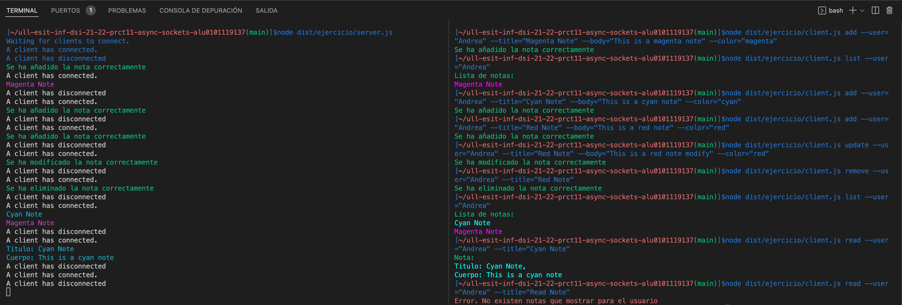
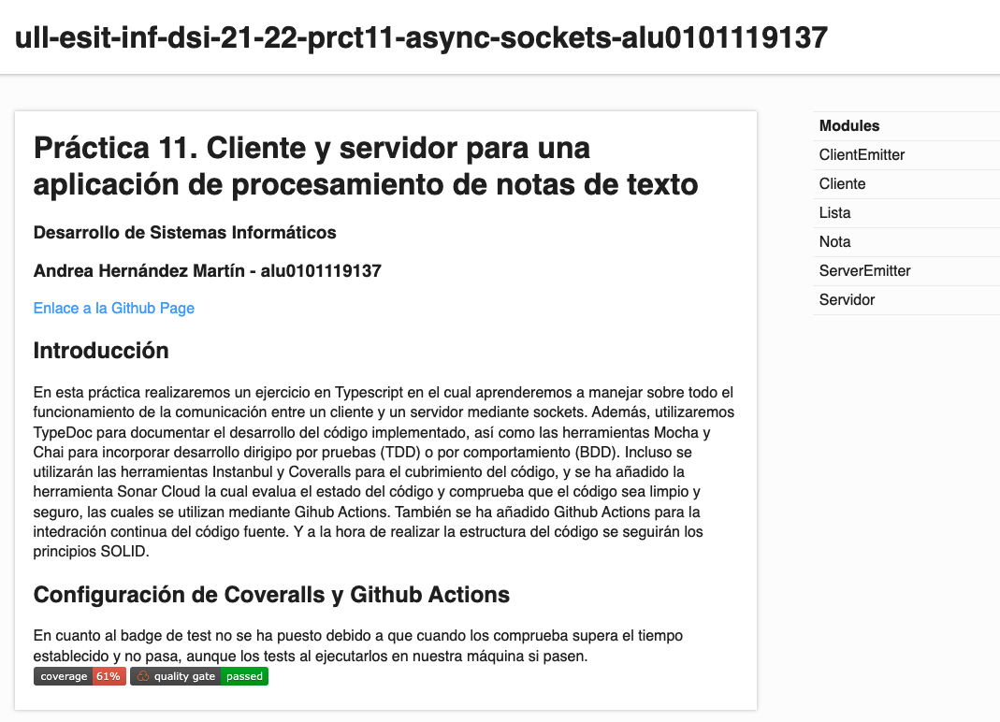
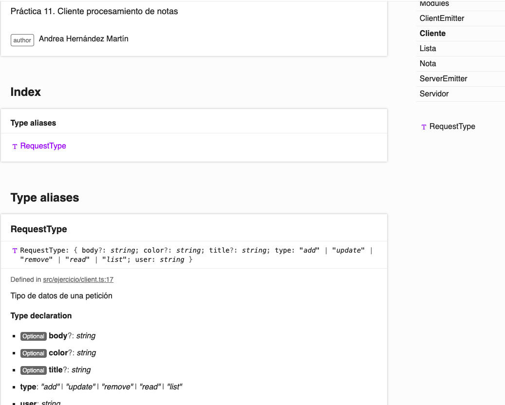
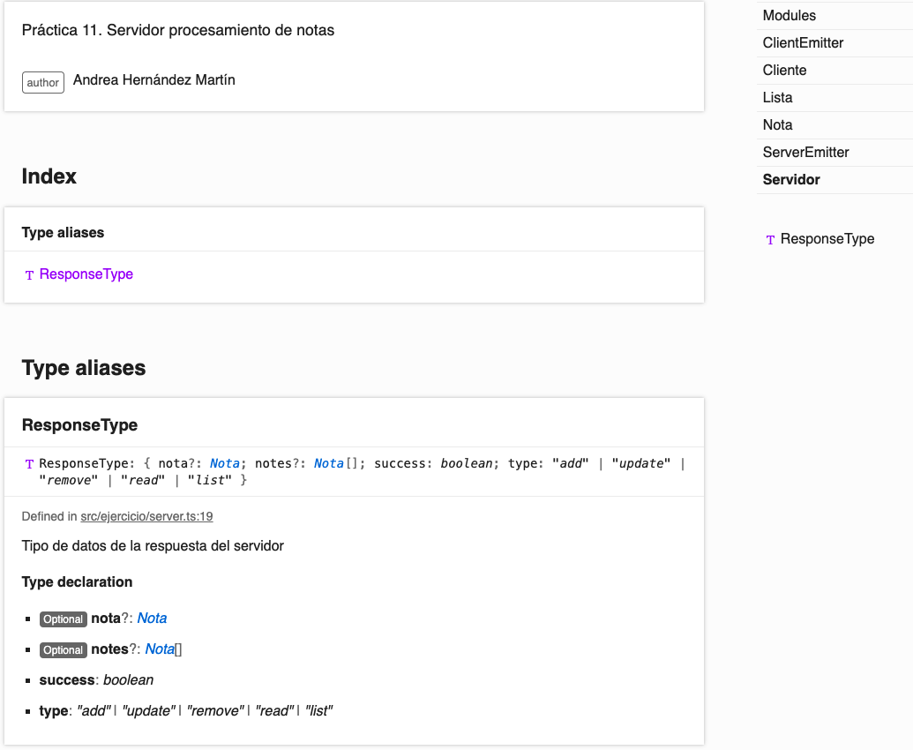

# Práctica 11. Cliente y servidor para una aplicación de procesamiento de notas de texto
### Desarrollo de Sistemas Informáticos
### Andrea Hernández Martín - alu0101119137
[Enlace a la Github Page](https://ull-esit-inf-dsi-2122.github.io/ull-esit-inf-dsi-21-22-prct11-async-sockets-alu0101119137/)

## Introducción  
En esta práctica realizaremos un ejercicio en Typescript en el cual aprenderemos a manejar sobre todo el funcionamiento de la comunicación entre un cliente y un servidor mediante sockets. Además, utilizaremos TypeDoc para documentar el desarrollo del código implementado, así como las herramientas Mocha y Chai para incorporar desarrollo dirigipo por pruebas (TDD) o por comportamiento (BDD). Incluso se utilizarán las herramientas Instanbul y Coveralls para el cubrimiento del código, y se ha añadido la herramienta Sonar Cloud la cual evalua el estado del código y comprueba que el código sea limpio y seguro, las cuales se utilizan mediante Gihub Actions. También se ha añadido Github Actions para la intedración continua del código fuente. Y a la hora de realizar la estructura del código se seguirán los principios SOLID.  

## Cliente y servidor para procesamiento de notas de texto  
Para esta práctica se nos pide utilizar la aplicación de notas creada en la práctica 9 realizada anteriormente, pero con el cambio de que ahora su funcionamiento es mediante peticiones entre un cliente y un servidor. El cliente debe solicitar la operación deseada por línea de comandos mediante el paquete `yargs` y el servidor debe procesar la petición y enviarle la respuesta al cliente. Esta conexión entre ambos se realizará mediante sockets.  

De la práctica anterior no hay que modificar las clases creadas, lo que se modifica es el fichero *app.ts* que contenía los comandos `yargs` y ahora será nuestro fichero que hace de cliente. También se creará otro fichero para realizar las tareas del servidor, así como, dos clases más para manejar los eventos que emite tanto el cliente como el servidor. Todo esto se comentará con detalle a continuación.  
- **Clase ClientEmitter:** esta clase es una clase que hereda de la clase `EventEmitter` y nos permite emitir tipos de eventos que nosotros queramos. La clase recibe un objeto `EventEmitter` el cual será un socket, que se utilizará para la comunicación. Cuando la clase **ClientEmitter** recibe el mensaje completo que se le pasa al socket y este mensaje está completo emite un evento tipo `message` y el mensaje transformado en un objeto JSON al cliente que usa la aplicación. Este evento lo maneja el cliente y se comentará a continuación.  
**Código:**
```ts
constructor(connection: EventEmitter) {
  super();

  let wholeData = '';
  connection.on('data', (dataChunk) => {
    wholeData += dataChunk;
  });

  connection.on('end', () => {
    this.emit('message', JSON.parse(wholeData));
  });
}
```
- **Cliente.ts:**  en este fichero lo que se hace en primer lugar es el manejo de los datos por líneas de comandos con el paquete `yargs`, las operaciones que se realizan con las notas son exactamente las mismas que en la práctica 9 por lo que esta parte no ha cambiado en cuanto a las operaciones, pero ha cambiado respecto a que antes en las operaciones se creaba la clase y se llamaba a la operación que se quería hacer, y ahora lo que hace es crear una petición del tipo `type RequestType = {type: 'add' | 'update' | 'remove' | 'read' | 'list'; user: string; title?: string; body?: string; color?: string;}` con los datos introducidos por teclado, la cual el cliente se la pasará al servidor.  
Una vez tenemos la petición creada, se crea el cliente mediante el módulo `net` de Node.js y un socket que es una instancia de nuesta clase **ClientEmitter**, y se le envía la petición al servidor. Se manejan también los errores de conexión mediante el cliente y mediante el socket manejamos el evento `message`, el cual lo que hace es escribir la respuesta que recibe del servidor a la operación que envió el cliente anteriormente.  

- **Clase ServerEmitter:** esta clase es una clase que hereda de la clase `EventEmitter` y nos permite emitir tipos de eventos que nosotros queramos. La clase recibe un objeto `EventEmitter` el cual será un socket, que se utilizará para la comunicación. Cuando la clase **ClientEmitter** recibe el mensaje completo que se le pasa al socket y este mensaje está completo emite un evento tipo `request` y el mensaje transformado en un objeto JSON al servidor que se está usando. Este evento lo maneja el servidor y se comentará a continuación.  
**Código:**
```ts
  constructor(connection: EventEmitter) {
    super();

    let wholeData = '';
    connection.on('data', (dataChunk) => {
      wholeData += dataChunk;

      let messageLimit = wholeData.indexOf('\n');
      while (messageLimit !== -1) {
        const message = wholeData.substring(0, messageLimit);
        wholeData = wholeData.substring(messageLimit + 1);
        this.emit('request', JSON.parse(message));
        messageLimit = wholeData.indexOf('\n');
      }
    });
  }
```
- **Server.ts:** en este fichero se crea un servidor mediante el módulo `net` de Node.js el cual recibe un socket *connection* y se crea otro socket de nuestra clase **ServerEmitter**. Mediante el socket *connection* nos comunicamos con el cliente, sabemos si un cliente se ha conectado o desconectado y se controlan los errores. Con el socket de nuestra clase, nos encargamos de manejar cuando llegan eventos de tipo `request`. Cuando llegan eventos de este tipo, en primer lugar se crea una respuesta del tipo `type ResponseType = {type: 'add' | 'update' | 'remove' | 'read' | 'list'; success: boolean; notes?: Nota[]; nota?: Nota | undefined;}`, la cual se le enviará al cliente una vez terminada las operaciones y a continuación se cerrará la comunicación con el cliente. Luego, cuando llega este evento, se comprueba el tipo de petición que le llegó al servidor a través del cliente, es decir, *add, update, remove, read o list*, y según la que sea hace las operaciones con las notas y devuelve en la respuesta si dicha operación fue satisfactoria o no, así como los datos que se necesiten para la respuesta según el tipo de operación que se hizo.  

A continuación se muestra un ejemplo de uso de la aplicación:  


## Documentación TypeDoc  
Para la documentación de los ejercicios utilicé la herramienta TypeDoc que convierte los comentarios en el código fuente de TypeScript en documentación HTML renderizada. A continuación, adjunto el enlace a la página web creada mediante TypeDoc.  
[Enlace repositorio documentación Typedoc](https://github.com/ULL-ESIT-INF-DSI-2122/ull-esit-inf-dsi-21-22-prct11-async-sockets-alu0101119137/tree/main/docs)  


 


## Testing  
Para la realización del testing de los ejercicios utilicé las herramientas Mocha y Chai.  
  
He realizado pruebas sobre la aplicación en los cuales compruebo que los valores pasados por parámetro dan el resultado esperado o al contrario, es decir, se comprueba que no dan el resultado esperado. Para ello he creado un fichero clase.spec.ts por cada clase implementada y he añadido algunas pruebas de todas las funciones utilizadas.  

Para la comprobación de código asíncrono, he comprobado que las clases que he creado emiten los eventos que se quieren cuando les llega el mensaje completo, en este caso, las clases emiten o un evento `request` o un evento `message`, y esto es lo que se comprueba en el testing de esas clases, mediante sockets.

A continuación muestro la salida en la terminal al ejecutar el test.   
```
  Tests de la clase ClientEmitter
    ✔ Emite un evento de "message" con el mensaje completo
    ✔ Emite un evento de "end" con el mensaje completo

  Tests de la clase Lista
    ✔ Se crea correctamente una instancia de la Lista
    ✔ Se accede al nombre del usuario de la lista correctamente
    ✔ Funciona el método encontrar una nota correctamente
    ✔ Funciona el método añadir una nota a la lista correctamente
    ✔ Funciona el método listar todos los nombres de las notas correctamente
    ✔ Funciona el método leer nombre y cuerpo de una nota correctamente
    ✔ Funciona el método modificar una nota de la lista correctamente
    ✔ Funciona el método eliminar una nota de la lista correctamente

  Tests de la clase Nota
    ✔ Se crea una clase Nota correctamente
    ✔ Se accede al título de la nota correctamente
    ✔ Se accede al cuerpo de la nota correctamente
    ✔ Se accede al color de la nota correctamente
    ✔ Se accede a la información completa de la nota correctamente
    ✔ Se imprime por consola la nota correctamente

  Tests de la clase ServerEmitter
    ✔ Emite un evento de "request" con el mensaje completo

  17 passing (52ms)
```

## Configuración de Coveralls y Github Actions  
En cuanto al badge de test no se ha puesto debido a que cuando los comprueba supera el tiempo establecido y no pasa, aunque los tests al ejecutarlos en nuestra máquina si pasen.  
[](https://coveralls.io/github/ULL-ESIT-INF-DSI-2122/ull-esit-inf-dsi-21-22-prct11-async-sockets-alu0101119137?branch=main)
[](https://sonarcloud.io/summary/new_code?id=ULL-ESIT-INF-DSI-2122_ull-esit-inf-dsi-21-22-prct11-async-sockets-alu0101119137)  

## Conclusiones  
Esta práctica me ha resultado interesante debido al funcionamiento del cliente y servidor, que no sabía como se realizaba con typescript y es algo nuevo que he aprendido. Me resultó bastante complejo el entender cómo funcionaban los sockets y cómo se pasaban los mensajes entre ellos, pero gracias a los apuntes de clase y a la ayuda del profesorado he logrado entender su funcionamiento y realizar la práctica. En cuanto a la parte de documentación al haberla realizado en todas las prácticas anteriores no me ha supuesto ningún inconveniente. Y en cuanto al testing, ha sido lo que más me ha costado, ya que había que probar código asíncrono con eventos y esto ha sido lo que más me ha costado entender. La configuración de coveralls y sonarcloud ha sido fácil de realizar ya que se ha hecho en la mayoría de prácticas anteriores.  

## Bibliografía  
- [Guión de la práctica](https://ull-esit-inf-dsi-2122.github.io/prct10-async-fs-process/)
- [Documentación TypeDoc](https://typedoc.org/)
- [Documentación Mocha](https://mochajs.org/)
- [Documentación Chai](https://www.chaijs.com/)
- [Documentación Instanbul](https://istanbul.js.org/)
- [Documentación Coveralls](https://coveralls.io/)
- [Sonar Cloud](https://sonarcloud.io/)
- [Documentación Yargs](https://www.npmjs.com/package/yargs)
- [Documentación Chalk](https://www.npmjs.com/package/chalk)
- [Node.js](https://nodejs.org/docs/latest-v17.x/api/)
- [Apuntes de clase sobre node.js.](https://ull-esit-inf-dsi-2122.github.io/nodejs-theory/nodejs-intro.html)
- [Apuntes de clase sobre el sistema de ficheros](https://ull-esit-inf-dsi-2122.github.io/nodejs-theory/nodejs-filesystem.html)
- [Apuntes de clase sobre sockets](https://ull-esit-inf-dsi-2122.github.io/nodejs-theory/nodejs-sockets.html)
